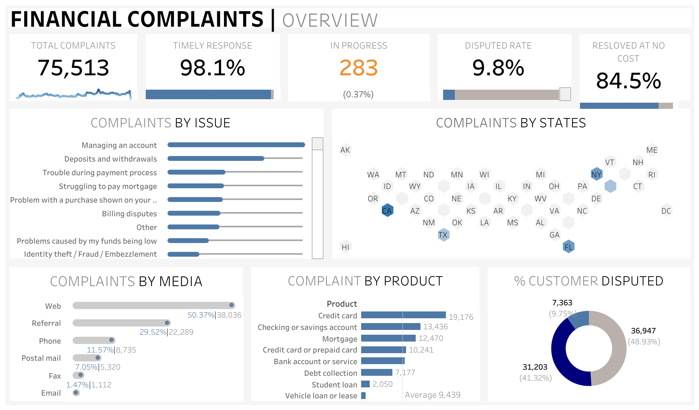

# Financial Complaints Dashboard

  

## Overview
The **Financial Complaints Dashboard** is an interactive Tableau visualization designed to provide insights into consumer financial complaints, their resolution status, and distribution across the United States. This dashboard helps businesses and regulatory bodies analyze key trends and improve customer satisfaction.

## Key Features

### 1. **Total Complaints Overview**
- Displays the **total number of complaints** recorded.
- Tracks the **timely response rate** to assess service efficiency.
- Shows the **percentage of cases resolved at no cost**, providing insights into consumer relief measures.

### 2. **Complaints by Issue**
- Categorizes complaints into common issues such as:
  - Managing an account
  - Deposits and withdrawals
  - Payment process disruptions
  - Mortgage-related struggles
  - Identity theft and fraud
  - Billing disputes
- Helps identify which areas need improvement in financial services.

### 3. **Geographical Distribution**
- **Visualizes complaint distribution by state** using an interactive heat map.
- Highlights complaint hotspots in states like **California, Texas, Florida, and New York**.
- Helps in regional analysis and targeted customer support improvements.

### 4. **Complaints by Media Channel**
- Displays how customers are submitting complaints through different channels:
  - Web submissions
  - Phone calls
  - Referrals
  - Postal mail
  - Fax and email
- Useful for identifying the most commonly used complaint submission methods and optimizing customer support channels.

### 5. **Complaints by Financial Product**
- Breaks down complaints based on product categories, including:
  - Credit cards
  - Checking and savings accounts
  - Mortgage services
  - Debt collection
  - Student loans and vehicle loans
- Helps financial institutions address product-specific issues effectively.

### 6. **Customer Dispute Rate Analysis**
- Tracks the **percentage of complaints that were disputed** by customers.
- Helps assess **customer satisfaction** and **effectiveness of issue resolution**.
- Aids financial institutions in improving complaint-handling mechanisms.

## How to Use the Dashboard
- **Navigate through the sections** to explore complaint trends across different dimensions.
- **Use filters and interactive elements** to drill down into specific categories, states, or products.
- **Identify trends and patterns** to help improve customer service and resolution strategies.

## Explore the Dashboard
[View the Tableau Dashboard](https://public.tableau.com/app/profile/divesh.harchandani/viz/FinancialComplaints_16549695599770/FCOverview)

---

### About the Creator
This dashboard was developed by **Divesh Harchandani**, leveraging Tableau to create a comprehensive and insightful financial complaints analysis tool. For any feedback or collaboration, feel free to connect!

